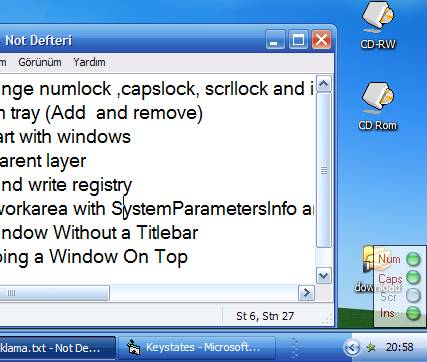



## Keystate

### Description

get and change numlock ,capslock, scrllock and insert key state

using system tray (Add and remove)

using self start with windows

using transparent layer

using read and write registry

get screen workarea with SystemParametersInfo and adjust form left and top with a Taskbar Visual

Moving a Window Without a Titlebar

always Keeping a Window On Top
 
### More Info
 

             |
---                |---
**Submitted On**   |2005-01-08 20:57:02
**By**             |[Coolslim](https://github.com/Planet-Source-Code/PSCIndex/blob/master/ByAuthor/coolslim.md)
**Level**          |Advanced
**User Rating**    |5.0 (15 globes from 3 users)
**Compatibility**  |VB 6\.0
**Category**       |[Windows API Call/ Explanation](https://github.com/Planet-Source-Code/PSCIndex/blob/master/ByCategory/windows-api-call-explanation__1-39.md)
**World**          |[Visual Basic](https://github.com/Planet-Source-Code/PSCIndex/blob/master/ByWorld/visual-basic.md)
**Archive File**   |[Keystate196361182006\.zip](https://github.com/Planet-Source-Code/coolslim-keystate__1-63981/archive/master.zip)

